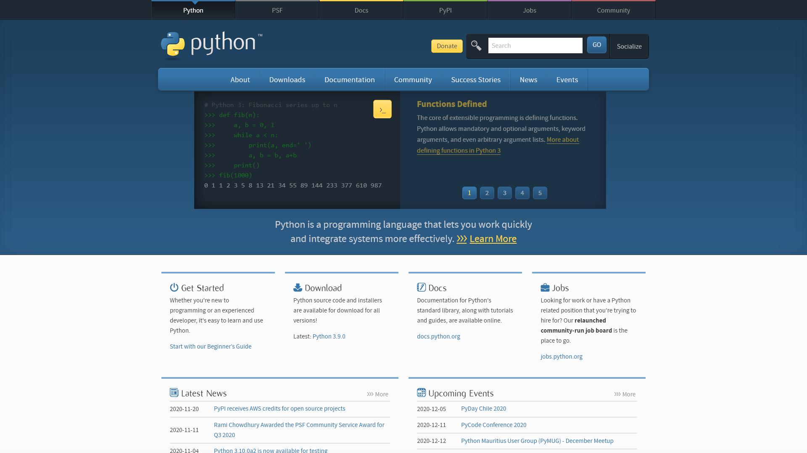

# HTML2Image
[


](https://pypi.org/project/html2image/)
[


](https://github.com/vgalin/html2image)

HTML2Image is a lightweight Python package that acts as a wrapper around the headless mode of existing web browsers to generate images from URLs and from HTML+CSS strings or files.

This package has been tested on Windows, Ubuntu (desktop and server) and MacOS. It is currently in a work in progress stage. If you encounter any problem or difficulties while using it, feel free to open an issue on the GitHub page of this project. Feedback is also welcome!


## Principle

Most web browsers have a Headless Mode, which is a way to run them without displaying any graphical interface. Headless mode is mainly used for automated testings but also comes in handy if you want to take screenshots of web pages that are exact replicas of what you would see on your screen if you were using the browser yourself.

However, for the sake of taking screenshots, headless mode is not very convenient to use. HTML2Image aims to hide the inconveniences of the browsers' headless modes while adding useful features such as allowing to create an image from as little as a string.

For more information about headless modes :
-   (Chrome) [https://developers.google.com/web/updates/2017/04/headless-chrome](https://developers.google.com/web/updates/2017/04/headless-chrome)
-   (Firefox) [https://developer.mozilla.org/en-US/docs/Mozilla/Firefox/Headless_mode](https://developer.mozilla.org/en-US/docs/Mozilla/Firefox/Headless_mode)

## Installation
HTML2Image is published on PyPI and can be installed through pip:

```console
pip install --upgrade html2image
```

In addition to this package, at least one of the following browsers **must** be installed on your machine :
-   Google Chrome (Windows, MacOS)
-   Chromium Brower (Linux)

## Usage

### First, import the package and instantiate it
```python
from html2image import Html2Image
hti = Html2Image()
```

<details>
<summary> Multiple arguments can be passed to the constructor (click to expand):</summary>

-   `browser` :  Browser that will be used, set by default to `'chrome'` (the only browser supported by HTML2Image at the moment)
-   `chrome_path` and  `firefox_path` : The path or the command that can be used to find the executable of a specific browser.
-   `output_path` : Path to the folder to which taken screenshots will be outputed. Default is the current working directory of your python program.
-   `size` : 2-Tuple reprensenting the size of the screenshots that will be taken. Default value is `(1920, 1080)`.
-   `temp_path` : Path that will be used by html2image to put together different resources *loaded* with the `load_str` and `load_file` methods. Default value is `%TEMP%/html2image` on Windows, and `/tmp/html2image` on Linux and MacOS.

Example:
```python
hti = Html2Image(size=(500, 200))
```

You can also change these values later: 
``` python
hti.size = (500, 200)
```
</details>
<br>

### Then take a screenshot

The `screenshot` method is the basis of this package, most of the time, you won't need to use anything else. It can take screenshots of a lot of things :
- URLs via the `url` parameter;
- HTML and CSS **files** via the `html_file` and `css_file` parameters;
- HTML and CSS **strings** via the `html_str` and `css_str` parameters;
- and "other" types of files via the `other_file` parameter (try it with .svg files!).

And you can also (optional):
- Change the size of the screenshots using the `size` parameter;
- Save the screenshots as a specific name using the `save_as` parameter.

*N.B. : The `screenshot` method returns a **list** containing the path(s) of the screenshot(s) it took.*

### A few examples

- **URL to image**
```python
hti.screenshot(url='https://www.python.org', save_as='python_org.png')
```

- **HTML & CSS strings to image**
```python
html = """<h1> An interesting title </h1> This page will be red"""
css = "body {background: red;}"

hti.screenshot(html_str=html, css_str=css, save_as='red_page.png')
```

- **HTML & CSS files to image**
```python
hti.screenshot(
    html_file='blue_page.html', css_file='blue_background.css',
    save_as='blue_page.png'
)
```

- **Other files to image**
```python
hti.screenshot(other_file='star.svg')
```

- **Change the screenshots' size**
```python
hti.screenshot(other_file='star.svg', size=(500, 500))
```

---

<details>
<summary> Click to show all the images generated with all the code above </summary>



</details>


---

- **Change the directory to which the screenshots are saved**
```python
hti = Html2Image(output_path='my_screenshot_folder')
```
**OR**
```python
hti.output_path = 'my_screenshot_folder'
```

*N.B. : the output path will be changed for all future screenshots.*

---

#### Use lists in place of any parameters while using the `screenshot` method
- Screenshot multiple objects using only one filename, or one filename per file:
```python
# create three files from one filename
hti.screenshot(html_str=['A', 'B', 'C'], save_as='ABC.png')
# outputs ABC_0.png, ABC_1.png, ABC_2.png

# create three files from from different filenames
hti.screenshot(html_str=['A', 'B', 'C'], save_as=['A.png', 'B.png', 'C.png'])
# outputs A.png, B.png, C.png
```
- Take multiple screenshots with the same size
```python
# take four screenshots with a resolution of 100*50
hti.screenshot(
    html_str=['A', 'B', 'C', 'D']
    size=(100, 50)
)
```
- Take multiple screenshots with different sizes
```python
# take four screenshots with different resolutions from three given sizes
hti.screenshot(
    html_str=['A', 'B', 'C', 'D'],
    size=[(100, 50), (100, 100), (50, 50)]
)
# respectively 100*50, 100*100, 50*50, 50*50
# if not enough sizes are given, the last size in the list will be repeated

```

- Apply CSS string(s) to multiple HTML string(s)
```python
# screenshot two html strings and apply css strings on both
hti.screenshot(
    html_str=['A', 'B'],
    css_str='body {background: red;}'
)

# screenshot two html strings and apply multiple css strings on both
hti.screenshot(
    html_str=['A', 'B'],
    css_str=['body {background: red;}', 'body {font-size: 50px;}']
)

# screenshot one html string and apply multiple css strings on it
hti.screenshot(
    html_str='A',
    css_str=['body {background: red;}', 'body {font-size: 50px;}']
)
```

---

- **Retrieve the path of the generated file(s)**  
The `screenshot` method returns a list containing the path(s) of the screenshot(s):

```python
paths = hti.screenshot(
    html_str=['A', 'B', 'C'],
    save_as="letters.png",
)

print(paths)
# >>> ['D:\\myFiles\\letters_0.png', 'D:\\myFiles\\letters_1.png', 'D:\\myFiles\\letters_2.png']
```

## Using the CLI
HTML2image comes with a Command Line Interface which you can use to generate screenshots from files and urls on the go.

The CLI is a work in progress and may be subject to changes.
You can call it by typing `hti` or `html2image` into a terminal.


| argument | description | example |
| - | - | - |
| -h, --help | Shows the help message | `hti -h` |
| -U, --urls | Screenshots a list of URLs | `hti -U https://www.python.org` |
| -H, --html | Screenshots a list of HTML files | `hti -H file.html` |
| -C, --css | Attaches a CSS files to the HTML ones | `hti -H file.html -C style.css` |
| -O, --other | Screenshots a list of files of type "other" | `hti -O star.svg` |
| -S, --save-as | A list of the screenshot filename(s)  | `hti -O star.svg -S star.png` |
| -s, --size | A list of the screenshot size(s) | `hti -O star.svg -s 50,50`|
| -o, --output_path| Change the output path of the screenshots (default is current working directory) | `hti star.svg -o screenshot_dir` |
| -q, --quiet| Disable all CLI's outputs | `hti --quiet` |
| -v, --verbose| More details, can help debugging | `hti --verbose` |
| --chrome_path| Specify a different chrome path ||
| --temp_path| Specify a different temp path (where the files are loaded)||

<br>

## Testing

Only basic testing is available at the moment. To run tests, run PyTest at the root of the project:
```
python -m pytest
```

## TODO List
-   A nice CLI (Currently in a WIP state)
    - A better way to name the CLI's outputed files ?
-   Support of other browsers, such as Firefox
-   More extensive doc + comments
-   PDF generation?
-   Testing on push/PR with GitHub Actions
-   Use threads or multiprocessing to speed up screenshot taking